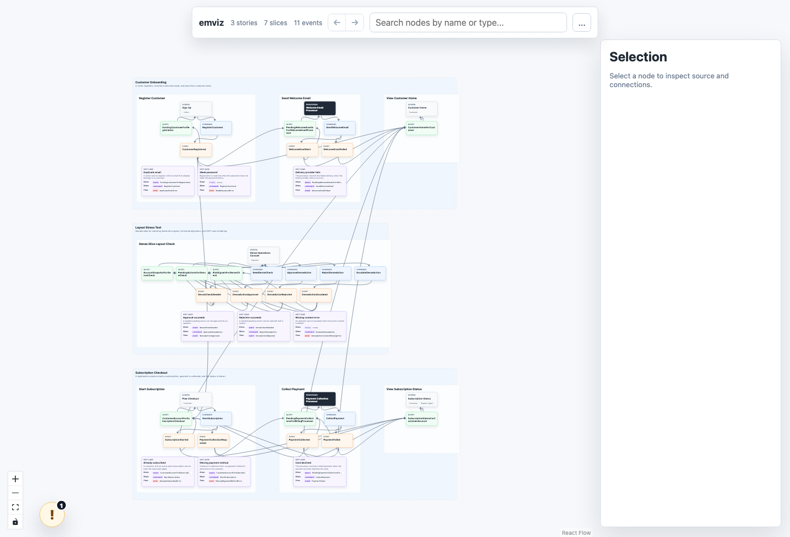
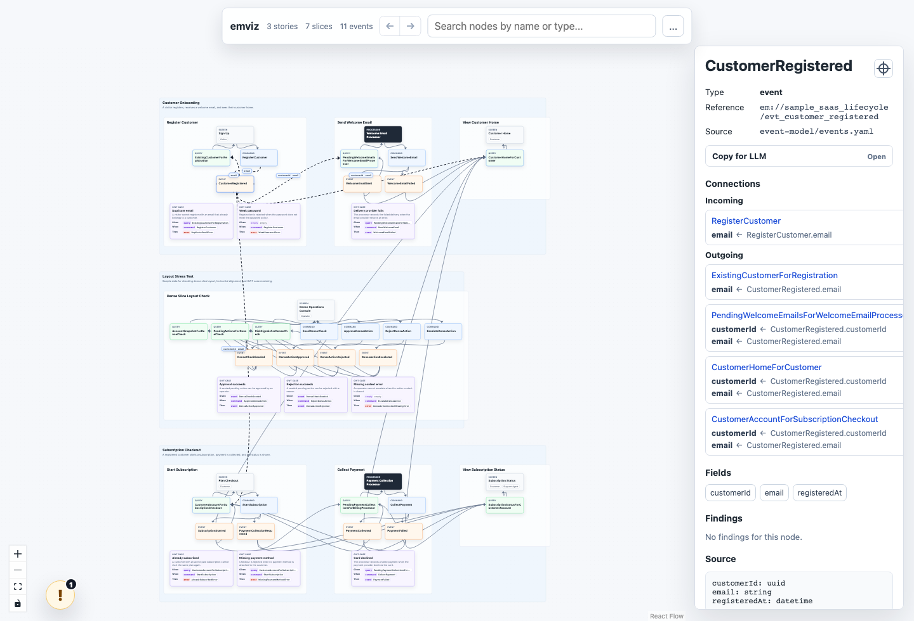
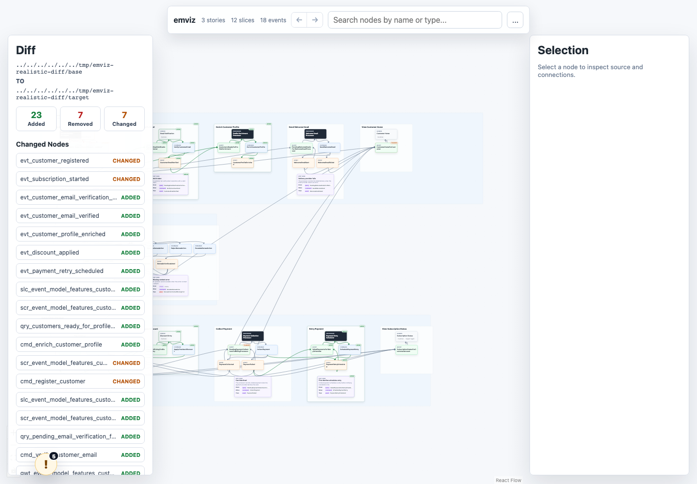
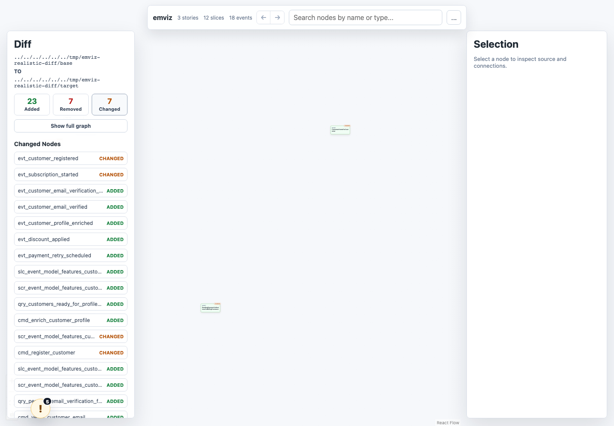

# emviz

`emviz` is an interactive visualizer for Event Modeling YAML projects. It renders stories, slices, screens, processors, commands, events, queries, and GWT cases as a directed graph so you can inspect model structure and trace behavior across slices.

It is not a YAML editor. The canonical model stays in your Event Modeling files; `emviz` helps you understand the graph, find validation issues, and copy precise context for LLM-assisted edits.



## Features

1. **Visualize Event Modeling YAML**
   - Story lanes and slice groups show the narrative flow.
   - Screens, processors, commands, events, queries, and GWT cases are rendered as graph nodes.

2. **Trace connections**
   - Click a node to inspect incoming and outgoing connections.
   - Search by node name, type, or source path.
   - Select a field name to see where data flows through events and queries.

3. **Review validation findings**
   - Open the validation drawer to inspect errors and warnings.
   - Focus findings directly on the related graph node.
   - Detect stale `.event-modeling/graph.json` selectors and other model drift.

4. **Copy context for LLM workflows**
   - Copy stable `em://...` node references.
   - Copy YAML excerpts, connected context, or an edit-prompt scaffold.

5. **Compare model versions**
   - Run `emviz diff` against a git ref or another project directory.
   - Review added, removed, and changed nodes on the same canvas.
   - Filter the canvas to focus on one kind of change.



## Quick Start

Run `emviz` from the root of an Event Modeling project:

```sh
npx emviz .
```

The CLI prints a local URL:

```text
  ->  Local:   http://localhost:5173/
Project: /path/to/your/project
```

If `.event-modeling/graph.json` is missing, `emviz` creates it on first project-mode startup.

## Companion Skills

Install the companion skills before using the modeling, extraction, or linting workflows:

```sh
gh skill install craftell/em
```

The installed skills provide:

1. `em-model` for creating canonical Event Modeling YAML.
2. `em-extract` for extracting candidate models from code or an Understand Anything knowledge graph.
3. `em-lint` for validating Event Modeling YAML.

## Usage

1. **Open a project**

   ```sh
   npx emviz .
   ```

   Loads the current directory as an Event Modeling project. This is the normal daily-use mode.

2. **Update the visualizer sidecar**

   ```sh
   npx emviz sync .
   ```

   Creates or updates `.event-modeling/graph.json`. Existing node IDs are preserved when possible.

3. **Use manual import mode**

   ```sh
   npx emviz
   ```

   Opens the browser app without a project server. Import a folder or select YAML / JSON files in the browser. This is useful for demos and one-off inspection.

4. **Export a standalone HTML file**

   Use the `...` menu in the top-right toolbar and choose `Export`. The exported HTML embeds the current model and can be opened without the project server.

5. **Compare two versions**

   ```sh
   npx emviz diff HEAD~1
   ```

   Compares the current project with a git commit, branch, or tag. The current working tree is used as the target.

   ```sh
   npx emviz diff --from HEAD~1 --to .
   npx emviz diff --from ../old-event-model --to .
   ```

   `--from` is the base model and `--to` is the target model. Each side can be a git ref or an Event Modeling project directory.

## Diff View

`emviz diff` opens the normal canvas with diff metadata layered onto the graph. Added nodes and edges are green, removed nodes and edges are red and dashed, and changed nodes are amber.



The left panel summarizes changed nodes and provides filters for added, removed, and changed graph elements.



## Input Files

`emviz` expects the Event Modeling YAML layout produced by the `em-model` and `em-extract` workflows:

```text
.event-modeling/
  config.yaml
  graph.json

event-model/
  events.yaml
  stories/
    *.yaml
  features/
    **/*.slice.yaml
```

`.event-modeling/config.yaml` is owned by the modeling workflow. `.event-modeling/graph.json` is owned by `emviz` and stores stable visualizer node IDs. Keeping that sidecar separate avoids adding visualizer-only IDs to canonical slice YAML.

## Interface

1. **Toolbar**
   - Shows story, slice, and event counts.
   - Provides back / forward selection history.
   - Searches nodes by name, type, or source path.

2. **Canvas**
   - Shows stories and slices as background groups.
   - Draws behavior flow from screen / processor to command, command to event, and event to query.
   - Uses React Flow controls for zoom and fit view.

3. **Selection panel**
   - Shows the selected node type, stable reference, source path, and source excerpt.
   - Lists incoming and outgoing connections.
   - Provides `Copy for LLM` actions for reference, YAML, context, and edit prompt.

4. **Validation drawer**
   - Open it from the `!` button in the lower-left corner.
   - Use `Focus` on a finding to jump to the related node.

## Understand Anything Integration

`emviz` does not directly render `.understand-anything/knowledge-graph.json`. The integration path goes through `em-extract` and [Understand Anything](https://github.com/Egonex-AI/Understand-Anything):

1. **Analyze the codebase with Understand Anything**

   ```text
   .understand-anything/knowledge-graph.json
   ```

   Understand Anything produces a knowledge graph of implementation entities and relationships.

2. **Extract candidate Event Modeling artifacts with `em-extract`**

   When `.understand-anything/knowledge-graph.json` is present, `em-extract` prefers it over broad code search. It uses implementation evidence such as routes, use cases, jobs, database writes, queries, and integrations to propose stories, slices, commands, events, and queries.

3. **Confirm and write Event Modeling YAML**

   Treat extraction output as a proposal. After domain review, write canonical YAML under `event-model/` using the `em-model` format.

4. **Visualize the result**

   ```sh
   npx emviz sync .
   npx emviz .
   ```

5. **Iterate with LLM assistance**

   Select a node in `emviz`, open `Copy for LLM`, and copy the reference, context, or edit prompt. Stable references use the `em://<model-id>/<node-id>` format, which makes follow-up edits easier to target.

## Local Development

This repository is a pnpm workspace.

```sh
pnpm install
pnpm build
pnpm test
```

Run the app during development:

```sh
pnpm dev
```

Run the local CLI build:

```sh
pnpm build
node packages/cli/dist/index.js .
```

## Package Layout

```text
packages/
  app/        # Vite + React visualizer
  cli/        # npx emviz entrypoint
  parser/     # Event Modeling YAML -> normalized graph
  validator/  # schema / graph / modeling checks
  graph/      # .event-modeling/graph.json sidecar

skills/
  em-model/    # Creates Event Modeling YAML
  em-extract/  # Extracts candidates from code or an Understand Anything graph
  em-lint/     # Validates Event Modeling YAML
```

## References

- [Architecture Spec](docs/emviz-architecture.md)
- [CLI README](packages/cli/README.md)
